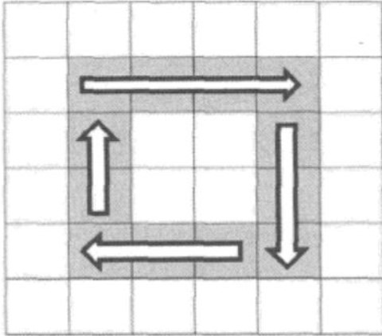

# algorithm-notes
常见算法代码
#  
#目录:

## 1. 输入一个矩阵,按照从外向里以顺时针的顺序依次打印出每一个数字
输入一个矩阵如下:
 1     2     3    4

 5     6     7    8

 9    10   11  12K

 13  14   15  16

 依次打印出数字:1,2,3,4,8,12,16,15,14,13,9,5,6,7,11,10

